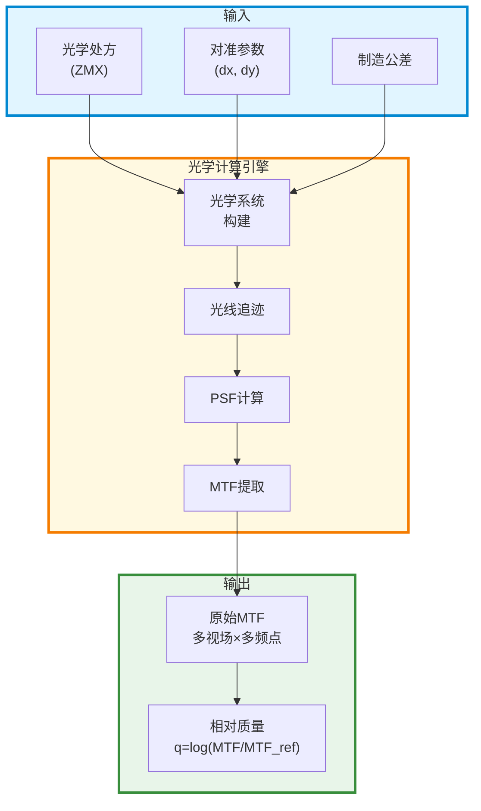
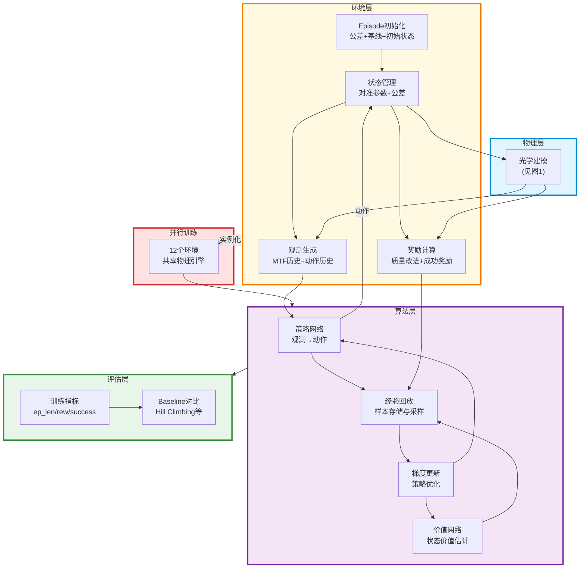

# RLAA系统架构图

## 图1：光学建模体系

## 图2：RL训练体系

## 系统架构说明

### 光学建模体系
- **输入层**：光学设计、对准参数、制造误差
- **计算核心**：光线追迹 → PSF → MTF
- **输出层**：原始MTF → 归一化质量指标

### RL训练体系
- **物理层**：光学建模提供环境反馈
- **环境层**：状态管理、观测生成、奖励计算
- **算法层**：SAC算法（Actor-Critic + 经验回放）
- **并行层**：多环境共享物理引擎
- **评估层**：性能统计与对比
